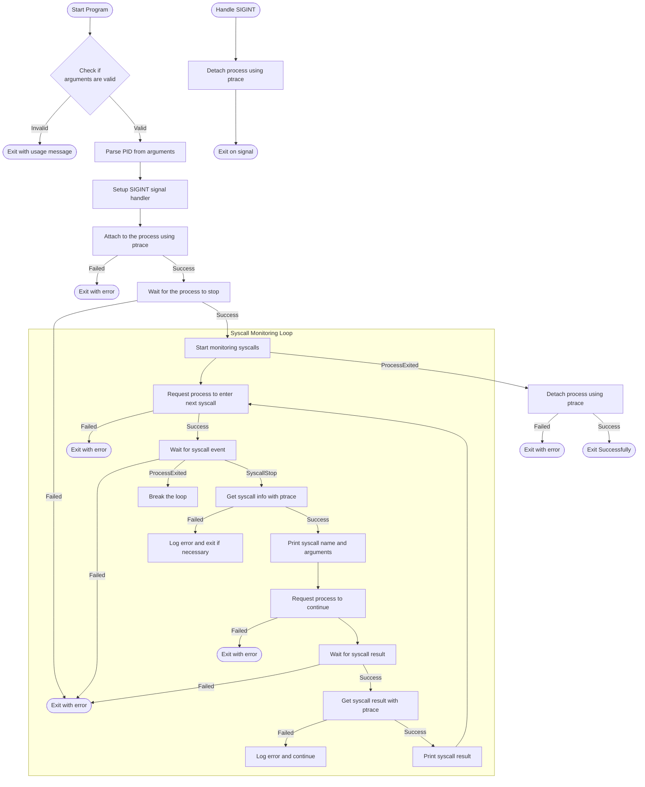

# Description

Trace system calls of a given pid with ptrace(2) and waitpid(1).

# Architecture



# Build

```bash
Usage: make <target>
Targets:
  all      Build the release version of systrace
  debug    Build the debug version of systrace_debug
  format   Format source files using clang-format
  clean    Remove generated binaries
  fast     Clean, format, and build the release version
```

# Usage

```bash
Usage: ./systrace <pid>
```
